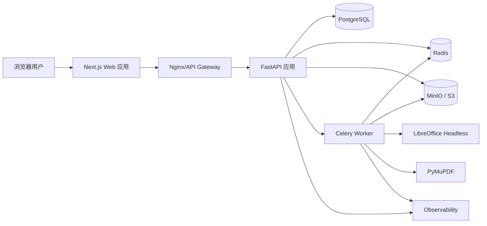
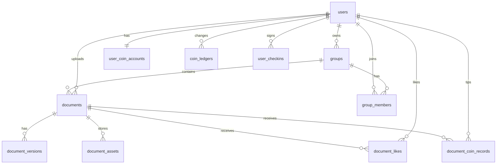
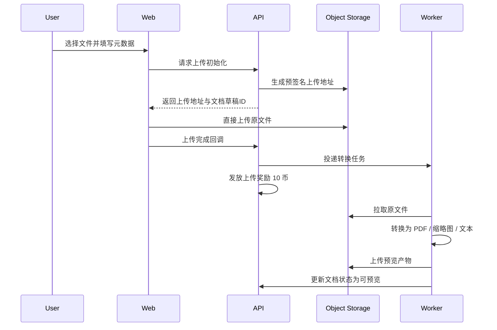

# 崇实文库架构设计文档

## 1. 文档信息

- 文档名称：崇实文库架构设计文档
- 当前版本：V1.1 草案
- 编写日期：2026-04-06
- 适用阶段：技术选型、系统设计、开发实施

## 2. 架构目标

本项目的架构设计目标如下：

- 支撑多用户注册、登录和资料管理
- 支撑多格式文档上传、转换、在线阅读和下载
- 支撑组级与文档级细粒度权限控制
- 支撑阅读量、点赞、投币、签到与积分流水
- 支撑未来逐步演进，而不是一次性引入过重的微服务体系
- 在开发效率、系统复杂度和后续扩展之间取得平衡

基于当前阶段，建议采用“前后端分离 + 单体后端 + 异步任务处理”的架构。

## 3. 总体技术选型

### 3.1 推荐技术栈

| 层次 | 技术方案 | 选型理由 |
| --- | --- | --- |
| Web 前端 | Next.js + React + TypeScript | 适合构建管理端与用户端统一 Web 应用，支持 SSR/CSR 混合渲染 |
| UI 组件 | Ant Design | 业务表单、后台组件和交互状态成熟，适合全站统一表单规范 |
| 图标系统 | Ant Design Icons + UnoCSS Icons | 业务图标优先使用 Ant Design Icons，额外 SVG 图标通过 UnoCSS Icons 扩展 |
| 样式系统 | UnoCSS | 原子化样式灵活，适合快速搭建页面与管理端 |
| 后端 API | Python + FastAPI | 开发效率高，适合 API、鉴权、异步任务集成 |
| ORM | SQLAlchemy | 与 FastAPI 生态契合，适合中大型业务建模 |
| 数据库 | PostgreSQL | 适合复杂查询、JSON 扩展、全文检索扩展和事务一致性 |
| 缓存/队列 | Redis | 适合缓存、会话、限流、异步任务 Broker、签到防重 |
| 异步任务 | Celery | 适合文档转换、缩略图生成、文本抽取等后台任务 |
| 对象存储 | MinIO / S3 | 适合原始文档、预览产物、封面图、缩略图存储 |
| 文档转换 | LibreOffice Headless | 可统一处理 Word/Excel/PPT 到 PDF 的转换链路 |
| PDF 处理 | PyMuPDF | 适合抽取文本、渲染封面和生成缩略图 |
| 网关/反向代理 | Nginx | 统一入口、静态资源分发、反向代理 |
| 可观测性 | Prometheus + Grafana + Sentry | 指标、告警和异常追踪 |

### 3.2 关于 MySQL 与 PostgreSQL 的取舍

虽然建议清单中同时提到了 MySQL 和 PostgreSQL，但首版不建议同时维护两套关系型数据库。推荐直接选择 PostgreSQL 作为主数据库，原因如下：

- 权限模型和资源查询较复杂，PostgreSQL 在复杂条件查询方面更灵活
- 未来如需全文检索、JSON 扩展字段、统计查询，PostgreSQL 更有优势
- 可减少首版维护成本

如果团队已有成熟的 MySQL 运维体系，也可以迁移为 MySQL 实现，但本文档后续设计默认基于 PostgreSQL。

## 4. 总体架构

## 4.1 分层说明

### 4.1.1 表现层

- 用户前台：资料浏览、搜索、在线阅读、下载、个人中心、积分中心、登录注册
- 管理后台：用户管理、文档管理、组管理、审核与监控、积分与互动管理
- 全站表单统一使用 Ant Design Form 实现，包括注册、登录和后续业务表单

### 4.1.2 接入层

- Nginx 统一对外暴露服务
- 提供 HTTPS、静态资源分发、反向代理、上传大小限制配置

### 4.1.3 应用层

FastAPI 单体应用承载以下职责：

- 用户认证与授权
- 文档元数据管理
- 资料组管理
- 权限判定
- 搜索接口
- 阅读量、点赞、投币和签到
- 积分账户与积分流水
- 上传回调与下载签名
- 后台管理接口

### 4.1.4 数据与基础设施层

- PostgreSQL：业务主数据库
- Redis：缓存、限流、异步任务 Broker、短期访问凭证、签到防重锁
- MinIO/S3：文档原件与预览产物存储
- Celery Worker：执行转换与离线处理任务

## 5. 核心架构决策

### 5.1 采用单体应用而不是微服务

原因如下：

- 当前业务仍处于 0 到 1 阶段
- 功能模块虽然多，但边界清晰，单体足以承载
- 可显著降低部署和联调复杂度
- 后续可按照任务处理、检索、审计、积分中心等维度逐步拆分

### 5.2 二进制文件与业务元数据分离

- 文档原文件和预览文件不存数据库，只存对象存储
- 数据库存储文件元数据、访问控制、任务状态、互动统计和索引信息
- 下载或预览时由后端签发短期访问地址

### 5.3 文档预览采用“统一转 PDF”方案

V1 建议将 Word、Excel、PPT 等文档统一转为 PDF 或页面快照，再通过 Web 端 PDF 阅读器展示，原因如下：

- 前端实现简单
- 体验稳定
- 可复用统一预览组件
- 与权限系统和水印策略更容易整合

未来若需要高保真阅读或在线协作，可接入 OnlyOffice 或 Collabora 作为增强方案。

### 5.4 权限采用 RBAC + ACL 的组合模式

- RBAC 用于系统层角色控制，例如管理员、普通用户、组管理员
- ACL 用于资源级授权，例如某份文档仅指定用户可见

这种组合更适合本项目“组权限 + 文档权限 + 指定用户访问”的场景。

### 5.5 积分采用“账户快照 + 流水留痕”模式

- `user_coin_accounts` 保存当前余额与累计收入支出
- `coin_ledgers` 保存每一笔积分变化
- 所有注册奖励、签到奖励、上传奖励、投币扣减都必须写入流水

该模式可以兼顾查询效率与审计可追溯性。

## 6. 模块设计

### 6.1 前端模块

#### 6.1.1 用户端

- 首页与资料列表
- 文档详情页
- 在线阅读页
- 搜索结果页
- 登录页与注册页
- 个人中心
- 我的上传
- 我的组
- 积分中心与签到入口

#### 6.1.2 管理端

- 用户管理
- 文档管理
- 资料组管理
- 转换任务监控
- 积分流水查看
- 点赞与投币记录查看
- 系统配置
- 日志审计

#### 6.1.3 资源规范

- 所有表单统一采用 Ant Design Form
- 图标优先采用 Ant Design Icons
- `assets/images` 存放图片资源
- `assets/svg` 存放 SVG 文件与额外图标资源
- `assets/videos` 存放视频或演示素材

### 6.2 后端模块

#### 6.2.1 认证模块

- 注册、登录、退出
- Access Token / Refresh Token
- 密码重置
- 登录限流

#### 6.2.2 用户模块

- 用户资料
- 用户状态管理
- 个人空间统计

#### 6.2.3 积分模块

- 注册奖励发放
- 上传奖励发放
- 每日签到发放
- 用户余额计算
- 积分流水查询

#### 6.2.4 资料组模块

- 创建、编辑、删除组
- 成员邀请、成员移除
- 组角色管理
- 组权限管理

#### 6.2.5 文档模块

- 上传初始化
- 上传完成回调
- 文档信息编辑
- 文档状态流转
- 预览地址签发
- 下载地址签发
- 阅读量统计

#### 6.2.6 互动模块

- 点赞
- 取消点赞
- 文档投币
- 文档互动统计

#### 6.2.7 权限模块

- 资源访问模式管理
- 指定用户授权名单维护
- 密码访问校验
- 文档有效权限计算

#### 6.2.8 搜索模块

- 标题搜索
- 标签搜索
- 分组筛选
- 全文搜索

#### 6.2.9 异步任务模块

- 文档转换
- 文本抽取
- 缩略图生成
- 封面生成
- 失败重试

## 7. 关键业务对象设计

### 7.1 主要实体

建议首版至少包含以下实体：

- users：用户
- groups：资料组
- group_members：组成员关系
- documents：文档主表
- document_versions：文档版本表
- document_assets：文档资源文件表
- user_coin_accounts：用户积分账户
- coin_ledgers：积分流水
- document_likes：文档点赞
- document_coin_records：文档投币记录
- user_checkins：用户签到记录
- acl_entries：资源访问控制表
- access_passcodes：密码访问配置
- audit_logs：审计日志
- download_logs：下载日志
- preview_jobs：预览转换任务

### 7.2 实体关系示意

### 7.3 核心字段建议

#### 7.3.1 users

- id
- username
- email
- phone
- password_hash
- nickname
- avatar_url
- status
- created_at
- updated_at

#### 7.3.2 groups

- id
- owner_id
- name
- description
- cover_url
- visibility_mode
- status
- created_at
- updated_at

#### 7.3.3 documents

- id
- owner_id
- group_id
- title
- description
- category
- file_type
- file_size
- preview_status
- visibility_mode
- allow_download
- read_count
- like_count
- coin_count
- created_at
- updated_at

#### 7.3.4 user_coin_accounts

- id
- user_id
- balance
- total_earned
- total_spent
- created_at
- updated_at

#### 7.3.5 coin_ledgers

- id
- user_id
- change_amount
- balance_after
- source_type
- related_document_id
- related_user_id
- created_at

#### 7.3.6 acl_entries

- id
- resource_type
- resource_id
- subject_type
- subject_id
- permission_type
- created_at

说明：

- `resource_type` 可取 `document` 或 `group`
- `subject_type` 可取 `user`、`group_role`
- `permission_type` 可取 `view`、`download`、`manage`

## 8. 权限与互动模型设计

### 8.1 访问模式枚举

建议统一定义：

- `public`
- `password`
- `owner_only`
- `group_members`
- `specific_users`

### 8.2 权限判定逻辑

文档访问判定逻辑建议如下：

1. 判断文档状态是否允许访问
2. 判断当前用户是否为系统管理员
3. 判断当前用户是否为文档所有者
4. 判断文档所属组是否存在访问边界
5. 判断文档访问模式
6. 若为密码访问，验证访问凭证
7. 若为组内可见，判断成员关系
8. 若为指定用户可见，判断 ACL 记录
9. 若请求下载，再额外判断 `allow_download`

### 8.3 组与文档的权限关系

- 无所属组的文档独立控制权限
- 有所属组的文档默认继承组权限
- 文档权限可以比组更严格
- 文档权限不能比组更宽松

这条规则非常关键，可以避免“私密组内出现公开文档”造成的权限穿透问题。

### 8.4 点赞规则

- 一个用户对同一文档最多保留一条点赞记录
- 点赞与取消点赞都要同步更新文档聚合计数

### 8.5 投币规则

- 投币必须在事务中同时完成余额扣减、文档计数更新和流水写入
- V1 默认禁止自投币
- 投币失败时不得出现余额已扣减但流水未写入的情况

## 9. 上传、阅读与预览链路设计

### 9.1 上传流程

### 9.2 阅读流程

1. 用户请求文档阅读页
2. 后端完成权限校验
3. 权限通过后签发预览资源
4. 文档 `read_count` 增加 1
5. 异步或同步写入阅读日志，供后续分析使用

### 9.3 预览处理建议

建议生成以下产物：

- 预览 PDF
- 首页封面图
- 多页缩略图
- 抽取文本内容

转换策略建议：

- PDF：直接生成缩略图与文本抽取
- DOC/DOCX：转 PDF 后预览
- XLS/XLSX：转 PDF 或按工作表生成页面快照
- PPT/PPTX：转 PDF 后预览

## 10. API 设计建议

推荐采用 RESTful API，统一放在 `/api/v1` 下。

### 10.1 认证相关

- `POST /api/v1/auth/register`
- `POST /api/v1/auth/login`
- `POST /api/v1/auth/logout`
- `POST /api/v1/auth/refresh`
- `POST /api/v1/auth/forgot-password`

### 10.2 用户相关

- `GET /api/v1/me`
- `PATCH /api/v1/me/profile`
- `GET /api/v1/me/documents`
- `GET /api/v1/me/groups`
- `GET /api/v1/me/coins`
- `GET /api/v1/me/coin-ledgers`
- `POST /api/v1/me/checkins`

### 10.3 资料组相关

- `POST /api/v1/groups`
- `GET /api/v1/groups`
- `GET /api/v1/groups/{groupId}`
- `PATCH /api/v1/groups/{groupId}`
- `DELETE /api/v1/groups/{groupId}`
- `POST /api/v1/groups/{groupId}/members`
- `DELETE /api/v1/groups/{groupId}/members/{userId}`

### 10.4 文档相关

- `POST /api/v1/documents/upload-init`
- `POST /api/v1/documents/upload-complete`
- `GET /api/v1/documents`
- `GET /api/v1/documents/{documentId}`
- `PATCH /api/v1/documents/{documentId}`
- `DELETE /api/v1/documents/{documentId}`
- `GET /api/v1/documents/{documentId}/preview`
- `POST /api/v1/documents/{documentId}/access/verify-password`
- `GET /api/v1/documents/{documentId}/download`
- `POST /api/v1/documents/{documentId}/like`
- `DELETE /api/v1/documents/{documentId}/like`
- `POST /api/v1/documents/{documentId}/coin`

### 10.5 搜索相关

- `GET /api/v1/search/documents`
- `GET /api/v1/search/groups`

## 11. 缓存与异步任务设计

### 11.1 Redis 使用方式

- 登录态或刷新凭证缓存
- 密码访问校验后的短期访问凭证
- 验证码缓存
- 签到幂等锁
- 限流计数器
- 热门搜索词缓存
- Celery Broker / Result Backend

### 11.2 Celery 任务分类

- `document_convert`
- `document_extract_text`
- `document_generate_cover`
- `document_generate_thumbnails`
- `document_retry_failed_jobs`

### 11.3 幂等性要求

- 同一文档重复回调不能生成重复记录
- 同一转换任务重复执行不能污染当前有效版本
- 任务状态更新必须基于版本号或状态机校验
- 每日签到需要自然日唯一约束
- 投币操作需要事务与幂等设计

## 12. 安全设计

### 12.1 身份认证

- Access Token 短有效期
- Refresh Token 长有效期
- Token 建议通过 HttpOnly Cookie 保存
- 密码采用 Argon2 或 bcrypt 哈希

### 12.2 文件安全

- 校验扩展名与 MIME 类型
- 限制可执行文件上传
- 预留病毒扫描接口
- 预览和下载通过签名地址控制

### 12.3 权限与积分安全

- 所有预览和下载操作必须经过后端鉴权
- 不能直接暴露永久对象存储地址
- 密码访问不应明文记录到日志
- 投币与签到接口必须具备幂等和防重机制
- 积分变动必须以数据库事务保证一致性

### 12.4 Web 安全

- CSRF 防护
- XSS 过滤
- SQL 注入防护
- 登录限流
- 审计日志留存

## 13. 搜索设计

### 13.1 V1 方案

V1 优先采用 PostgreSQL 全文检索能力，满足以下需求：

- 标题搜索
- 简介搜索
- 抽取文本搜索
- 标签搜索

优点：

- 实现成本低
- 架构简单
- 与业务库一致性高

### 13.2 V2 演进

当数据量和检索复杂度提升后，可演进为 Elasticsearch 或 OpenSearch：

- 更强的全文检索能力
- 更好的高亮、分词、聚合
- 更适合海量文档搜索

## 14. 部署架构建议

### 14.1 开发环境

- 1 个 Next.js 服务
- 1 个 FastAPI 服务
- 1 个 PostgreSQL
- 1 个 Redis
- 1 个 MinIO
- 1 个 Celery Worker

可使用 Docker Compose 快速启动。

### 14.2 生产环境

- Nginx 反向代理层
- 至少 2 个 FastAPI 实例
- 至少 2 个 Celery Worker 实例
- PostgreSQL 主从或托管数据库
- Redis 高可用方案
- MinIO 集群或云对象存储
- 监控告警系统

## 15. 可观测性设计

至少应覆盖以下内容：

- API 请求量、响应耗时、错误率
- 文档上传成功率
- 文档转换成功率
- 任务平均耗时
- 下载量与预览量
- 阅读量、点赞量、投币量
- 签到成功率与积分发放量
- 后台异常告警

建议接入：

- Prometheus 指标采集
- Grafana 可视化看板
- Sentry 异常追踪
- 结构化日志输出

## 16. 开发顺序建议

### 16.1 第一阶段

- 搭建前后端工程
- 完成账号体系
- 完成积分账户与签到
- 完成资料组 CRUD
- 完成文档元数据模型

### 16.2 第二阶段

- 完成上传与对象存储
- 完成异步转换链路
- 完成预览页

### 16.3 第三阶段

- 完成 ACL 权限模型
- 完成阅读量、点赞与投币
- 完成搜索能力

### 16.4 第四阶段

- 完成后台管理与日志
- 压测
- 安全测试
- 上线部署

## 17. 风险与应对

### 17.1 Office 转换兼容性风险

- 风险：不同 Office 文件格式在转换时可能存在样式丢失
- 应对：首版优先支持常见格式和正常文档，保留原文件下载兜底

### 17.2 大文件上传稳定性风险

- 风险：网络不稳定导致上传失败
- 应对：采用分片上传和断点续传

### 17.3 权限模型复杂度风险

- 风险：组权限与文档权限组合容易出现漏洞
- 应对：统一 ACL 模型，严格遵循“文档不能突破组边界”原则

### 17.4 全文检索性能风险

- 风险：文档数量提升后 PostgreSQL 检索性能下降
- 应对：V1 使用 PostgreSQL，V2 视规模演进到独立搜索引擎

### 17.5 积分刷取风险

- 风险：通过自投币、重复签到、脚本刷接口等方式套取积分
- 应对：禁止自投币、签到接口做自然日唯一约束、积分变动强制流水留痕

## 18. 结论

对于崇实文库，当前最适合的首版方案是：

- 前端采用 Next.js + React + Ant Design + UnoCSS
- 全站表单统一采用 Ant Design Form
- 图标以 Ant Design Icons 为主，UnoCSS Icons 作为扩展
- 后端采用 FastAPI 单体应用
- PostgreSQL 作为唯一主数据库
- Redis 作为缓存和异步任务基础设施
- MinIO/S3 负责文件存储
- Celery + LibreOffice 构建文档预览转换链路

该方案能较好覆盖当前需求，同时保留后续向搜索增强、在线编辑、推荐系统与积分商城演进的空间。
